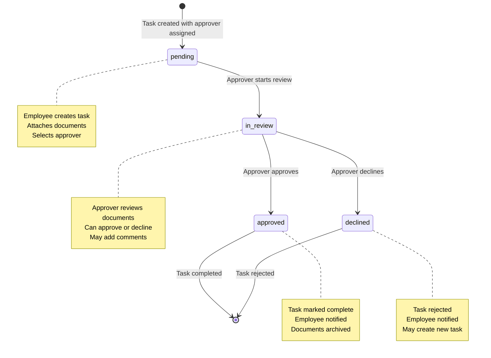

# Task Orchestration - Approval Workflow State Machine

## Overview
This document defines the state machine for task approval workflows, including all possible states, transitions, and validation rules.

## Workflow States

## State Definitions

### `pending`
- **Description**: Task has been created and assigned to an approver, waiting for review
- **Entry Conditions**:
  - Task created with `assigneeId` set
  - `approverId` set (if approval task)
  - `taskType` = 'approval' or 'general'
- **Allowed Actions**:
  - Edit task details (creator only)
  - Add/remove attachments (creator only)
  - Change approver (creator only)
  - Move to `in_review` (approver only)
- **Exit Transitions**:
  - → `in_review`: Approver starts review

### `in_review`
- **Description**: Task is being reviewed by the assigned approver
- **Entry Conditions**:
  - Previous state was `pending`
  - Current user is the approver
- **Allowed Actions**:
  - View all attachments
  - Add comments
  - Approve task
  - Decline task with comment
- **Exit Transitions**:
  - → `approved`: Approver clicks approve
  - → `declined`: Approver clicks decline

### `approved`
- **Description**: Task has been approved and completed
- **Entry Conditions**:
  - Previous state was `in_review`
  - Approver made approval decision
- **Allowed Actions**:
  - View task (read-only)
  - Download attachments
- **Exit Transitions**:
  - None (terminal state)

### `declined`
- **Description**: Task has been declined by the approver
- **Entry Conditions**:
  - Previous state was `in_review`
  - Approver made decline decision
- **Allowed Actions**:
  - View task (read-only)
  - View decline reason
  - Create new task (creator only)
- **Exit Transitions**:
  - None (terminal state)

## Transition Rules

### State Transition Matrix

| From State | To State | Conditions | Triggered By |
|------------|----------|------------|--------------|
| pending | in_review | Current user is approver | Approver action |
| in_review | approved | Current user is approver | Approve button |
| in_review | declined | Current user is approver | Decline button |

### Validation Rules

1. **Creator Permissions**:
   - Can edit task in `pending` state only
   - Can change approver in `pending` state only
   - Can add/remove attachments in `pending` state only

2. **Approver Permissions**:
   - Can view task in any state
   - Can move `pending` → `in_review`
   - Can decide `in_review` → `approved` or `declined`

3. **General Rules**:
   - Tasks must have assignee when created
   - Approval tasks must have approver
   - Only approvers can make decisions
   - Decisions require comments (optional for approve, required for decline)

## Notification Triggers

### Task Created (`pending`)
- **Recipients**: Assignee, Approver (if different)
- **Message**: "New task assigned: {title}"
- **Channels**: In-app, Email

### Task Under Review (`in_review`)
- **Recipients**: Creator
- **Message**: "Your task is now under review: {title}"
- **Channels**: In-app, Email

### Task Approved (`approved`)
- **Recipients**: Creator
- **Message**: "Task approved: {title}"
- **Channels**: In-app, Email

### Task Declined (`declined`)
- **Recipients**: Creator
- **Message**: "Task declined: {title}. Reason: {decisionComment}"
- **Channels**: In-app, Email

## Error States

### Invalid Transitions
- **Error**: "Cannot move task from {currentState} to {targetState}"
- **Causes**: Attempting invalid state change
- **Resolution**: Check user permissions and current state

### Permission Denied
- **Error**: "You don't have permission to perform this action"
- **Causes**: Non-approver trying to approve/decline
- **Resolution**: Check user role against task requirements

## Implementation Notes

### Frontend Considerations
- Disable action buttons based on user permissions and current state
- Show different UI elements based on task state
- Validate transitions before API calls

### Backend Considerations
- Enforce state transition rules in API endpoints
- Validate user permissions for each action
- Send notifications on state changes
- Maintain audit trail of state changes

### Database Considerations
- Store state change history
- Index on status for performance
- Foreign key constraints for assignee/approver